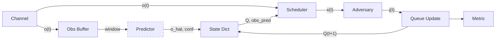

# Phalanx

[](https://doi.org/10.5281/zenodo.19483902)

<div align="justify">

**Open-source adversarial scheduling simulator for multi-link wireless networks.**

Phalanx is an ns-3-compatible Python simulation framework for adversarial resource scheduling across multi-link stochastic wireless channels. It ships five channel models (correlated Gaussian VAR(1), Markov-modulated, non-stationary, NTN/LEO orbital with Kepler geometry and Rice fading, and pre-recorded trace replay), eleven scheduling policies (Lyapunov drift-plus-penalty with Stackelberg robustness, bandit-based exploration, Whittle index, AoI-aware index policies, and standard baselines), five adversary/jammer models (budget-constrained, Stackelberg best-response, reactive listen-then-jam, Markov-modulated, and benign), a pluggable observation predictor interface with uncertainty-aware confidence hooks, and five metric collectors (throughput-cost, queue backlog, per-source Age-of-Information, per-packet delay with P95/P99, and prediction error NMSE/RMSE).

Everything is composable via factory dispatch and YAML/JSON configuration, so any combination of channel, scheduler, adversary, and predictor works without modification. The ns-3 bridge API (via ns3-ai) mirrors the native simulation loop so that schedulers and predictors behave identically against both Phalanx's built-in channel models and live ns-3 PHY-layer simulations. A multi-seed parallel runner with spawn-context multiprocessing and Student's t-distribution confidence intervals handles statistical aggregation, and deterministic seeding guarantees bit-identical reproducibility across runs.

</div>

---

<div align="justify">

## Architecture and Simulation Loop

Phalanx is built around five abstract base classes: `Channel`, `Scheduler`, `Adversary`, `Predictor`, and `Metric`. A `Simulation` orchestrator composes one instance of each and runs a discrete-time loop. At every time slot, the channel produces an observation vector `o(t)` of shape `(M, d_obs)` where M is the number of links. The scheduler reads the current observation and state (including queue backlogs, arrivals, and optionally a prediction) and returns a resource allocation vector on the probability simplex. The adversary observes the allocation and current channel quality, then produces a perturbation vector subject to its budget constraint. Finally, the orchestrator computes per-flow service rates, updates queues via `Q(t+1) = max(Q(t) + arrivals - service, 0)`, and passes everything to the metric collector.

### Prediction Pipeline

If a predictor is registered, the orchestrator maintains a rolling buffer of past observations, feeds the most recent window to the predictor's `encode()` method to obtain a latent representation, calls `predict()` to produce a forecast, and calls `confidence()` to obtain a scalar uncertainty estimate. These are injected into the shared state dictionary as `obs_pred` and `pred_confidence` for the scheduler to consume. The predictor is entirely optional: when absent, the loop runs without `obs_pred` in the state, and schedulers that support prediction gracefully fall back to current observations only.



### Composability and Extensibility

The scheduler never knows which channel model generates observations, the adversary never knows which scheduling policy it faces (it only sees the allocation), and the predictor is pure observation-to-forecast with no scheduling logic. Any M x N x K combination of channels, schedulers, and adversaries works without modification. Custom components are added by subclassing the relevant ABC and calling `register_channel()`, `register_scheduler()`, `register_adversary()`, or `register_predictor()` without modifying Phalanx source. The `Predictor` ABC uses numpy-only I/O so downstream packages can wrap PyTorch, JAX, or analytical models without imposing framework dependencies on Phalanx itself.

### Configuration and Reproducibility

All simulation parameters are nested dataclasses (`SimConfig`, `ChannelConfig`, `SchedulerConfig`, `AdversaryConfig`, `PredictorConfig`) with YAML/JSON round-trip serialisation. Every component accepts a deterministic NumPy `Generator`, guaranteeing bit-identical results with the same seed. The `MultiSeedSimulator` runs N independent seeds in parallel using spawn-context multiprocessing and aggregates results with Student's t-distribution confidence intervals.

</div>

---

## Installation

```bash
git clone https://github.com/g-ampo/phalanx.git
cd phalanx
pip install -e .
```

Optional dependencies:

```bash
pip install -e ".[torch]"    # PyTorch for ML predictors
pip install -e ".[dev]"      # pytest, mypy, ruff
pip install -e ".[all]"      # everything
```

**Requirements:** Python 3.10+, NumPy >= 1.24, SciPy >= 1.10, Matplotlib >= 3.7, PyYAML >= 6.0

---

## Quick Start

```python
import numpy as np
from phalanx.channels import GaussianVARChannel
from phalanx.config import ChannelConfig
from phalanx.schedulers import LyapunovDPP
from phalanx.adversaries import StackelbergAdversary
from phalanx.metrics import CostMetric
from phalanx.core import Simulation

channel = GaussianVARChannel(
    ChannelConfig(M=8, d_obs=4, var_coefficient=0.9),
    rng=np.random.default_rng(42),
)
scheduler = LyapunovDPP(V=5.0, F=4, J_total=0.5)
adversary = StackelbergAdversary(J_total=0.5)
metric = CostMetric()

sim = Simulation()
result = sim.run(channel, scheduler, adversary, metric, T=5000, seed=42)
print(f"Avg cost: {result['final_avg']:.4f}")
```

### Multi-Seed Runs with Confidence Intervals

```python
from phalanx.simulator import MultiSeedSimulator

runner = MultiSeedSimulator(n_seeds=30, n_workers=4)
agg = runner.run(channel, scheduler, adversary, metric, T=10000, base_seed=42)

mean, lo, hi = agg["ci"]
print(f"Cost: {mean:.4f} [{lo:.4f}, {hi:.4f}] (95% CI)")
```

### Prediction-Augmented Scheduling

```python
from phalanx.predictors import PersistencePredictor

predictor = PersistencePredictor(d_obs_total=8 * 4)

result = sim.run(
    channel, scheduler, adversary, metric,
    T=5000, seed=42,
    predictor=predictor, obs_window_size=20,
)
```

Register custom predictors (e.g. a VAE or Kalman filter):

```python
from phalanx.predictors import Predictor, register_predictor

class MyVAEPredictor(Predictor):
    def encode(self, obs_window):
        ...  # (W, d_obs_total) -> (d_z,)
    def predict(self, z):
        ...  # (d_z,) -> (d_obs_total,)
    def confidence(self, z):
        ...  # (d_z,) -> scalar uncertainty

register_predictor("my_vae", MyVAEPredictor)
```

### Trace Replay

Evaluate on real-world measurement data:

```python
from phalanx.channels import ReplayChannel

traces = np.load("my_traces.npy")  # shape (T_total, M, d_obs)
channel = ReplayChannel(traces, M=8, d_obs=4, segment_length=10000)
```

### ns-3 Integration

The `NS3Bridge` mirrors the native simulation loop's prediction pipeline so schedulers behave identically in both modes:

```python
from phalanx.ns3 import NS3Bridge

bridge = NS3Bridge(env_id="phalanx-v0", M=8, d_obs=4, F=4)
bridge.register_scheduler(scheduler)
bridge.register_predictor(predictor, obs_window_size=20)
bridge.register_metric(CostMetric())
result = bridge.run(T=1000)
```

The API is stable; full ns-3 co-simulation via ns3-ai is future work.

---

## Project Structure

```
phalanx/
    __init__.py              # v0.2.1, top-level exports
    core.py                  # ABCs: Channel, Scheduler, Adversary, Metric
                             # Simulation orchestrator, service rate / cost helpers
    config.py                # Nested dataclasses with YAML/JSON serialisation
    simulator.py             # MultiSeedSimulator (spawn-context parallelism)
    plotting.py              # IEEE-style publication-ready figures
    channels/                # 5 channel models + factory
    schedulers/              # 11 scheduling policies + factory
    adversaries/             # 5 adversary models + factory
    predictors/              # Predictor ABC + PersistencePredictor + factory
    metrics/                 # 5 metric collectors + t-distribution CI
    ns3/                     # NS3Bridge (prediction-aware, stub + full mode)
tests/                       # 132 pytest cases across 7 modules
examples/                    # 3 runnable scripts (quickstart, DPP validation,
                             # ns-3 bridge demo)
```

---

## Testing

```bash
pytest tests/ -v
```

132 test cases covering:
- Channel shape, save/restore, temporal correlation, trace replay
- Scheduler simplex validity, V-sensitivity, oracle correctness
- Adversary budget constraints, activity rates
- Metric CI computation, AoI tracking, prediction error
- Predictor ABC compliance, factory dispatch, simulation integration
- NS3 bridge pipeline, observation conversion, determinism

---

## Citing Phalanx

If you use Phalanx in your research, please cite:

```bibtex
@software{amponis2026phalanx,
  author    = {Amponis, George},
  title     = {Phalanx: An Open-Source Adversarial Scheduling Simulator
               for Multi-Link Wireless Networks},
  year      = {2026},
  publisher = {Zenodo},
  doi       = {10.5281/zenodo.19483902},
  url       = {https://github.com/g-ampo/phalanx},
  license   = {MIT},
}
```

---

## License

MIT. See [LICENSE](LICENSE) for the full text.
